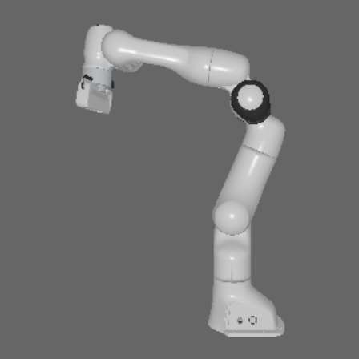
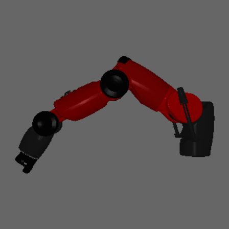
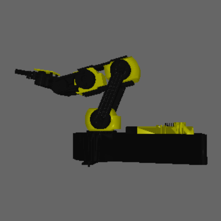
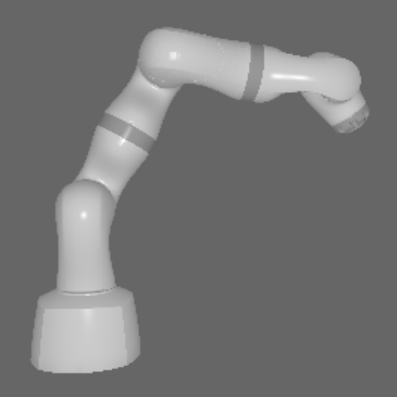
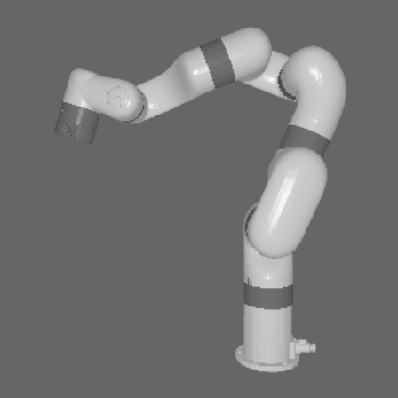
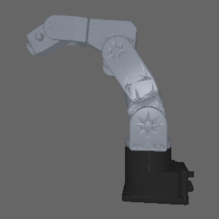

# robot-renderer

PyTorch3D-based robot renderer for generating multi-view synthetic templates from URDF models.

Given a robot's URDF, mesh files, camera intrinsics, and a joint configuration, `robot-renderer` renders the robot from multiple views and returns:

- Template images `(3, H, W)` for each view
- Ground-truth camera poses `T_m2c` (4 x 4, OpenCV convention, metres) per view
- A `mesh_transform` (4 x 4) to map poses back into the original URDF base frame
- A point cloud of the surface that is visible in the rendered views (metres)
- Per-view depth maps `(N, H, W)` in metres

View directions are sampled on a Fibonacci sphere and scored by how much of the robot's surface they see (no rendering needed for the scoring). The best view becomes the anchor, and the remaining views are chosen with farthest point sampling so they cover clearly different angles. All N views are then rendered in a single batched PyTorch3D pass.

Example templates for the six built-in robots:

| Franka Panda | Baxter (left arm) | OWI-535 | KUKA LBR Med 7 | UFACTORY xArm 7 | Meca500 |
| :---: | :---: | :---: | :---: | :---: | :---: |
|  |  |  |  |  |  |

---

## Installation

This package depends on **PyTorch3D**, which requires careful version matching
with your PyTorch and CUDA installation. The steps below install the tested
combination (Python 3.10, PyTorch 2.4.1, CUDA 12.1). Other recent combinations
may work but are not guaranteed; override `PT3D_WHEEL` for a different CUDA or
PyTorch version (see the wheel index at
https://dl.fbaipublicfiles.com/pytorch3d/packaging/wheels/).

### 1. Create and activate a conda environment

```bash
conda create -n robot-renderer python=3.10 pip -c conda-forge -y
conda activate robot-renderer
```

### 2. Run setup

```bash
cd robot-renderer
make setup
```

This chains three steps automatically:

1. PyTorch 2.4.1 + torchvision CUDA 12.1 wheels (`make install-torch`)
2. fvcore, iopath, and the matching PyTorch3D wheel (`make install-pt3d`)
3. robot-renderer (editable) with the assets and test extras (`make install`)

PyTorch comes from the pip CUDA wheels (`download.pytorch.org/whl/cu121`), which
match the PyTorch3D wheel exactly. Installing PyTorch from conda instead can
pull a build that does not match, which makes PyTorch3D fail to load at runtime.

### 3. Verify

```bash
make check
```

Expected output:

```text
torch: 2.4.1+cu121
pytorch3d: ok
robot_renderer: ok
All checks passed.
```

Then render Panda views through the full pipeline to verify the PyTorch3D
installation end to end:

```bash
make test
make render-check
```

### 4. Fetch the non-redistributable assets (optional)

Two robots (`meca500`, `owi535`) have assets we cannot ship because their
upstream sources declare no license (see `MESH_LICENSES/README.md`). Run this
only if you need either of those robots:

```bash
make assets
```

`make assets` is safe to re-run: it skips robots whose assets are already
present. The other robots (including Panda) ship with the package and need no
download.

---

## Quick start

```python
import numpy as np
import robot_renderer as rr

# Camera intrinsics (here: a RealSense D435)
K = np.array([
    [606.0,   0.0, 319.5],
    [  0.0, 606.0, 241.5],
    [  0.0,   0.0,   1.0],
], dtype=np.float32)

# The built-in Panda ships with the package
renderer = rr.RobotRenderer(
    name="panda",
    K=K,
    config=rr.ViewConfig(
        render_size=448,
        viewset="fibonacci_256",
        num_views=8,
        orientation="simple_upright",
    ),
)

# Render 8 template views for one joint configuration
joint_angles = np.zeros(7, dtype=np.float32)
result = renderer.render_templates(joint_angles)

for i, view in enumerate(result.views):
    print(f"View {i}: image={view.image.shape}, gt_pose={view.gt_pose.shape}")
```

Rendering runs on the CPU by default (PyTorch convention). To use the GPU,
call `renderer.to("cuda")` after construction, or pass `device="cuda"`
directly; see "Device placement" below.

See "Pose frame recovery" below for how to map a predicted pose back into the
URDF base frame.

---

## Exporting posed meshes

Use these methods when a caller needs a posed mesh instead of rendered
templates.

### `export_posed_trimesh`: in-memory mesh

Returns the robot at the given joint configuration as a
`trimesh.Trimesh` in millimetres, centred at the bounding-box centre.

```python
mesh, mesh_transform = renderer.export_posed_trimesh(joint_angles)

# mesh:           trimesh.Trimesh, vertices in mm, origin at the bounding-box centre
# mesh_transform: (4,4) array that maps URDF base coordinates (metres) to the mesh frame (mm)
```

One thing to be careful about: `mesh_transform` contains a scale factor of
1000 (metres to mm) in its rotation block, so it is not a rigid transform.
Do not multiply it directly into a predicted pose. To recover `T_base_cam`
in metres from a predicted `T_m2c`:

```python
R = T_m2c[:3, :3]
t = T_m2c[:3, 3]
center_mm = -mesh_transform[:3, 3]

T_base_cam = np.eye(4)
T_base_cam[:3, :3] = R
T_base_cam[:3, 3] = (t - R @ center_mm) / 1000.0
```

### `export_posed_mesh`: write to disk

Assembles the posed mesh and writes it to a PLY or OBJ file. It returns the
path and the transform needed to recover the original URDF frame.

```python
out_path, mesh_transform = renderer.export_posed_mesh(
    joint_angles,
    output_path="mesh.ply",
    scale_mm=True,
)
```

---

## Registering a custom robot

```python
import robot_renderer as rr
from my_package import MyRobotAdapter  # implements get_joint_R_t()

rr.register(
    name="ur5",
    urdf="path/to/ur5.urdf",
    mesh_dir="path/to/meshes/",
    adapter_cls=MyRobotAdapter,
    mesh_files=[               # one inner list per link, in FK output order
        ["path/to/meshes/base.obj"],
        ["path/to/meshes/shoulder.obj"],
        # ...
    ],
)

renderer = rr.RobotRenderer("ur5", K=K)
result = renderer.render_templates(joint_angles)
```

The `adapter_cls` must implement `get_joint_R_t(joint_angles) -> (R, t)` where:

- `R`: `(n_links, 3, 3)` rotation matrices in the robot base frame
- `t`: `(n_links, 3)` translation vectors in the robot base frame, in **metres**
- `joint_angles` are in radians
- The order must match the order of the mesh files

The easiest way to write an adapter is to subclass
`robot_renderer.robots.LinkChainAdapter` and set `LINK_INDICES`,
`BASE_LINK_IDX`, and `NUM_JOINTS`. See `robots/panda/adapter.py` for a
complete example.

> **The mesh order matters.** If you leave out `mesh_files`, OBJ files are
> collected from `mesh_dir` in alphabetical order, and that order has to match
> the link order of `get_joint_R_t()`. A wrong count raises an error right
> away, but a wrong *order* with the right count renders the links in the
> wrong places without any warning. It is safer to always pass `mesh_files`
> yourself, as in the example above.

---

## Per-link color overrides

By default, vertex colors come from the OBJ MTL files. To override colors per
link, pass a `color_mapping` dict. Its keys are matched against the
`_`-separated parts of the mesh filename: the key `"link0"` matches
`link0.obj`, but a key like `"base_link"` will never match, because only
single parts such as `"base"` or `"link"` are compared.

```python
renderer = rr.RobotRenderer(
    name="panda",
    K=K,
    color_mapping={
        "link0": [0.4, 0.4, 0.4],
        "link7": [0.8, 0.6, 0.2],
        "default": [0.5, 0.5, 0.5],  # used when no key matches
    },
)
```

When `color_mapping` is `None` (the default), the MTL colors are used.

---

## Device placement

Everything is created on the CPU by default. Move the renderer (and all its
outputs) to the GPU with `.to()`, or construct it there directly with
`device="cuda"`:

```python
import torch

renderer = rr.RobotRenderer("panda", K=K)
renderer.to(torch.device("cuda"))

result = renderer.render_templates(joint_angles)
assert result.views[0].image.is_cuda
```

---

## Background options

Templates are rendered with flat grey backgrounds by default (varied slightly across views):

```python
cfg = rr.ViewConfig(
    backgrounds=[
        [0.25, 0.25, 0.25],
        [0.35, 0.35, 0.35],
    ]
)
```

To use a blurred image as the render background:

```python
import torch
import robot_renderer as rr

query_chw = ...  # (3, H, W) float tensor
blurred_bg = rr.gaussian_blur_chw(query_chw, sigma=4.0)  # (3, H, W)
blurred_hw3 = blurred_bg.permute(1, 2, 0)                # (H, W, 3)

result = renderer.render_templates(joint_angles, background_image=blurred_hw3)
```

---

## View configuration reference

| Parameter | Default | Description |
| --- | --- | --- |
| `render_size` | `448` | Output image resolution (H=W, square) |
| `viewset` | `"fibonacci_256"` | View generation strategy (see below) |
| `num_views` | `8` | Final number of templates returned |
| `sphere_distance_factor` | `2.5` | Camera distance = bounding sphere radius times this factor |
| `elevation_range` | `(-5.0, 5.0)` | Elevation band for Fibonacci sampling (degrees) |
| `anchor_elevation_range` | `None` | Optional band that limits which view can become the anchor (index 0) |
| `orientation` | `"simple_upright"` | How to orient the mesh before rendering (see below) |
| `diverse_selection` | `True` | Pick diverse views (anchor + farthest point sampling) instead of just the N best-scored ones |
| `backgrounds` | grey list | Per-view RGB background colors (cycled) |
| `fill_frame` | `False` | Crop each view to the robot silhouette and resize it back so every template fills the frame consistently |
| `fill_frame_pad` | `0.1` | Relative padding around the silhouette before the square crop |
| `fill_frame_min_px` | `64` | Views with fewer silhouette pixels than this are left un-cropped |

**Viewset options:**

- `"fibonacci_N"`: N near-uniform directions on the sphere, filtered to `elevation_range`, then scored and selected
- `"four_sides"`: 4 views at 0/90/180/270 degrees azimuth, 0 degrees elevation
- `"eight_sides"` / `"ring_8"`: 8 views at 45 degree azimuth steps
- `"hemisphere_8"`: 4 equatorial views + 4 at 30 degrees elevation

Any other name raises a `ValueError`, so a typo cannot silently change the sampling.

**Orientation modes:**

- `"simple_upright"`: aligns the robot base Z-axis to the rendering Y-up axis. Deterministic and independent of the joint configuration. Recommended.
- `"align_mesh_longest_axis_upright"`: PCA longest axis to Y-up.
- `"align_mesh_longest_axis_top_right"`: PCA longest axis to the upper-right (45 degree diagonal).
- `"end_effector_frame"`: rotates the mesh into the end-effector orientation (FK on the last link), pivoting around the EE origin. The mesh is not re-centred.

---

## Units & conventions

One rule: **everything inside the renderer is in metres**. Millimetres only
appear in the two mesh export methods.

| Quantity | Unit / convention |
| --- | --- |
| Adapter FK translations (`get_joint_R_t`) | metres (URDF convention) |
| `RenderResult` geometry (`mesh_verts`, `visible_surface_points`, `sphere_radius`, `mesh_transform` translation) | metres, aligned frame |
| Camera poses (`views[i].R/T/gt_pose`, `anchor_gt_pose`) | OpenCV T_m2c, translation in metres |
| `zbuf` | camera-Z depth in metres, -1 = background |
| `export_posed_trimesh()` | **millimetres**, origin at the bounding-box centre |
| `export_posed_mesh(scale_mm=True)` | **millimetres** (`scale_mm=False` keeps metres) |
| Camera intrinsics `K` | pixels |
| Joint angles | radians |
| View azimuth / elevation, `elevation_range` | degrees |

URDFs written in millimetres (like the OWI-535) are converted to metres inside
their adapter (`LinkChainAdapter.T_SCALE = 0.001`), so no other code ever
sees mm.

Two terms used throughout:

- **T_m2c** is the transform from model (mesh) coordinates to camera
  coordinates: `p_cam = R @ p_model + t`.
- **OpenCV convention** means the camera looks along +Z, with X pointing
  right and Y pointing down in the image.

---

## Pose frame recovery

Templates are rendered in an "aligned" coordinate frame (after mesh orientation). To recover a pose in the original URDF base frame:

```python
T_pred = ...  # (4,4) pose predicted in the aligned frame
T_urdf_cam = T_pred @ result.mesh_transform
```

`result.mesh_transform` is the 4 x 4 rigid transform from the URDF frame to the aligned frame, applied to the mesh before rendering.

---

## RenderResult fields

```python
result.views                    # List[RenderedView], one per template
result.views[i].image           # (3, H, W) float [0,1] tensor
result.views[i].R               # (3,3) camera rotation  (OpenCV convention)
result.views[i].T               # (3,) camera translation, metres (OpenCV convention)
result.views[i].gt_pose         # (4,4) T_m2c in OpenCV convention, translation in metres

result.mesh_transform           # (4,4) URDF-to-aligned transform for pose recovery
result.mesh_verts               # (V,3) aligned mesh vertices, metres
result.visible_surface_points   # (M,3) face centroids visible across all views, metres
result.sphere_radius            # float, bounding sphere radius, metres (aligned frame)
result.anchor_gt_pose           # (4,4) gt_pose of the best-scored (anchor) view
result.anchor_idx               # int, always 0
result.orientation_center       # (3,) orientation pivot in the URDF frame, metres
result.zbuf                     # (N,H,W) camera-Z depth per view, metres; -1 = background
```

---

## Package structure

```text
src/robot_renderer/
|-- __init__.py
|-- config.py
|-- mesh_ops.py
|-- obj_mesh_colors.py
|-- registry.py
|-- renderer_pt3d.py
|-- robot_model.py
|-- robot_renderer.py
|-- template_pipeline_pt3d.py
|-- types.py
|-- view_strategy.py
`-- robots/
    |-- baxter/
    |-- lbr_med7/
    |-- meca500/
    |-- owi535/
    |-- panda/
    `-- xarm7/
```

---

## Not included

Two features came up during development but did not make it into this release
(contributions welcome):

- Differentiable rendering (gradients through the camera pose, via the PyTorch3D soft rasterizer)
- A generic URDF adapter that reads the link-to-mesh mapping from the URDF itself, so custom robots would not need an adapter class

---

## License & asset provenance

The source code is MIT-licensed (see `LICENSE`). The robot URDF/mesh assets
under `src/robot_renderer/robots/` are third-party works under their own
licenses (Apache-2.0 / BSD-3-Clause / MIT); two robots' source-derived assets
(`meca500`, `owi535`) have no declared upstream license and are downloaded via
`make assets` instead of being redistributed. See `MESH_LICENSES/` for the
upstream license texts and its `README.md` for the full per-robot provenance
table, attribution, and statement of changes.
